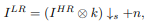
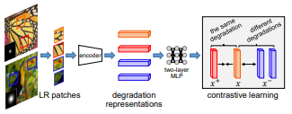
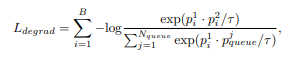
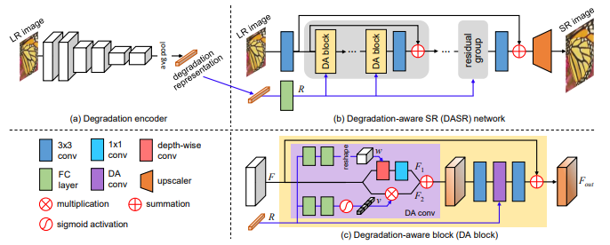
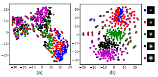
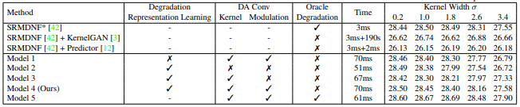

# DASR  
Unsupervised Degradation Representation Learning for Blind Super-Resolution  
본 코드는 DASR 논문, 공식코드를 참고하여 다시 작성한 코드입니다.  

## 1. 개요  
이전까지 연구된 고정된 Degradation 기반 SR 학습 방식은 좋은 성능을 보이지만 실생활에서 발생하는 랜덤한 degrade에 관해서 대처를 잘 하지 못하고 성능이 떨어지는 모습을 보인다. 또한 이를 해결하기 위해 반복적으로 degrade를 없애는 방식으로 성능이 좋아졌지만 너무 많은 시간이 소모된다는 단점이 있다. 본 논문은 이를 해결하기 위해 명확한 degrade 표현을 사용하는 대신 추상적인 degrade 표현을 사용하여 degradation representations를 학습하고 이를 유연하게 활용할 수 있는 Degradation-Aware SR(DASR)을 소개한다.

## 2. 이전까지의 연구
### 1. Single Image Super-Resolution  
Super-Resolution 기술은 최초의 네트워크인 SRCNN을 시작으로 지금까지 많은 발전이 있었다. 최근에는 second-order channel attention을 활용하는 네트워크로 우수한 성능을 입증했지만 단일 degradation(바이큐빅 다운샘플링)이라는 제한적인 성능을 보인다.  
이러한 degradation 문제를 해결하기위해 다양한 degradation 기법을 적용시키는 SRMD, UDVD 등의 네트워크가 등장하였다.  
이 후 zero-shot 이라는 방식을 활용한 ZSSR, meta-learning 방식을 활용한 MZSR 방식이 등장하였지만 사용된 degradation method에 대한 의존성이 너무 커서 잘못된 정보를 가져올 경우 성능이 많이 떨어지는 모습을 보였다.  
이러한 문제를 해결하기 위해 degrade 정보를 점진적으로 반복하여 학습하는 IKC가 제안되었고 실제로 성능이 좋았다. 하지만 반복적인 추론을 진행하다보니 시간 소모적인 부분에서 많은 손해가 발생한다.  

### 2. Contrasive Learning  
기존에는 고정된 이미지를 이용하여 학습을 진행했다. 하지만 GAN 기반 네트워크 에서는 상반된, 대조적인 데이터를 이용하여 학습하는 것이 더 효과적임이 입증되었다. 이는 representation space를 최대화 하기 때문이다.  

## 3. DASR Methodology  
### 1. Problem Formulation  
  
LR 이미지를 생성하기 위한 Degradation 수식을 위 그림과 같이 정의하였다. I-HR은 HR이미지를 의미하며 k는 블러 커널을 의미한다. s는 다운 스케일 배율을 의미하며 n은 가우시안 노이즈를 의미한다.  
DASR에서는 우선 노이즈가 없는 상태로 Isotropic Gaussian kernels을 이용하여 학습을 진행한 후, Anisotropic Gaussian kernels과 노이즈를 함께 사용하여 general model을 학습한다. 

### 2. Degradation Representation Learning  
전체적인 네트워크 과정은 degradation encoder를 통해 degradation representation을 추출하고 이를 이용하여 degradation-aware SR network를 통과하여 최종 SR 결과를 얻는 것이다.  
  
우선 대조적인 학습을 진행한다. 하나의 이미지에서 두 개의 패치를 얻고 이를 positive samples 이라고 한다. 다른 하나의 이미지에서도 두 개의 패치를 얻고 이를 negative samples 라고 한다. 이 때 두 이미지는 서로 다른 degradation 적용한다. 이 후, 이러한 패치들을 6개의 convolution layer를 통과시켜 degradation information을 얻는다.  
  
content에 따라 변하지 않는 degradation representations을 얻기위해서 다양한 content와 degradation을 큐에 담아서 유지할 필요가 있다. 이를 위해 Loss degrad를 사용한다. N-queue는 샘플 큐의 개수, p-j-queue는 negative sample을 의미한다. 이러한 과정은 특정 degradation을 구분하기 위한 좋은 degradation representations를 얻을 수 있고 HR이 필요 없는 비지도 학습에 유리하다.  

### 3. Degradation-Aware SR Network  
  
DA 블록은 block과 RCAN 에서 사용된 높은 레벨의 구조를 빌드하는데 사용된다. DASR 네트워크는 5개의 residual 그룹으로 구성되고 각각의 그룹은 5개의 DA 블록으로 구성된다.  
각각의 DA 블록 내부에서는 degradation representation을 기반으로한 fearures를 적용시키기 위해 두 개의 DA convolution layer를 사용한다. DA convolution layer를 이용하여 depth-wise convolution layer의 커널을 예측한다. 구체적으로 degradation representations R은 FC convolution layer를 통과하고 reshape layer를 통과한다. 이러한 결과를 input F 와 3x3 depth-wise convolution 연산을 수행한다.  
또한 channel-wise feature 적용을 위해 modulation coefficient를 학습한다. 구체적으로 R 은 FC layer를 통과하고 sigmoid 연산후에 채널 별로 rescale 된 후 input F와 연산 후 최종적으로 F-out을 생성한다.  
이전에 사용된 대부분의 multiple degradation SR 모델은 degradation 정보와 image feature를 CNN 레이어에 그대로 전달을 했다. 이러한 방식은 두 정보 사이의 도메인 차이가 크기 때문에 성능이 좋지 않다. 하지만 DASR은 특정 degradation에 부합하는 정보를 적용할 수 있기 때문에 성능이 좋다.  

## 4. Training  
가우시안 커널 사이즈는 21x21로 설정하였고 전체 네트워크를 학습하기 이전에 노이즈가 없는 상태에서 Isotropic 가우시안 커널을 사용하여 학습을 시킨다. 커널의 범위는 업 스케일링 2, 3, 4배 각각 [0.2, 2.0], [0.2, 3.0], [0.2, 4.0] 으로 설정한다.  
그 후 전체 네트워크를 Anisotropic 가우시안 커널과 노이즈를 추가하여 학습한다. 범위는 [0, 시그마] 이 때 시그마는 공분산 행렬을 의미하는 데 값은 랜덤한 고유 값과 랜덤한 회전 방향에 따라 결정된다. 노이즈 레벨은 [0, 25] 범위로 설정한다.  
32개의 랜덤한 HR 이미지를 선택하여 augmentation을 수행하고 랜덤한 가우시안 커널, 노이즈를 적용한다. 그리고 64개의 LR patch들이 48x48 사이즈로 랜덤하게 crop 된다. 본 논문에서는 Loss-degrade의 하이퍼 파라미터의 값을 각각 0.07, 8192로 설정하였다.  
Optimizer는 Adam 방식을 이용하였고 b 값은 각각 0.9, 0.999로 설정하였다. learning rate는 degradation encoder를 학습시킬 때 0.001로 학습시키다 60epoch에서 0.0001로 변경하여 총 100epoch 학습시킨다. 이 후 전체 네트워크를 학습시킬 때 0.0001로 학습을 시작하다가 125epoch마다 1/2로 변경하여 총 500epoch 학습을 진행한다. 전체적인 Loss는 L1 loss + Loss-degrade로 구성한다.  

## 5. Ablation Study  
### 1. Degradation Representation Learning  
  
Degradation Representation Learning 방식의 효과를 확인하기 위하여 Loss-degrade를 제거하고, 분리된 학습 방식을 제거하여 전체 네트워크만 500epoch 학습시켜서 결과를 비교하였다. 결과는 T-SNE 방식을 이용하여 표현하였고 DASR 방식(b)이 우수한 성능을 보여줌을 알 수 있다.  

### 2. Degradation-Aware Convolutions  
  
Degradation encoder를 이용하여 얻은 degradation representation 정보를 DA convolutions에 통합하고, channel-wise 계수와 커널을 예측함으로 서로 다른 degrade를 유연하게 다룰 수 있다. 이를 확인하기 위하여 DA를 제거하고 일반적인 CNN을 사용하여 실험을 진행하였고 결과는 표에서 알 수 있다. Model2는 DA를 제거하였고, Model3은 channel-wise 계수를 제거하였다.  
